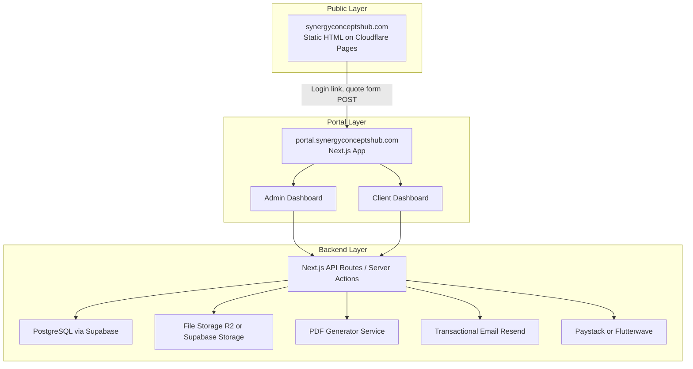
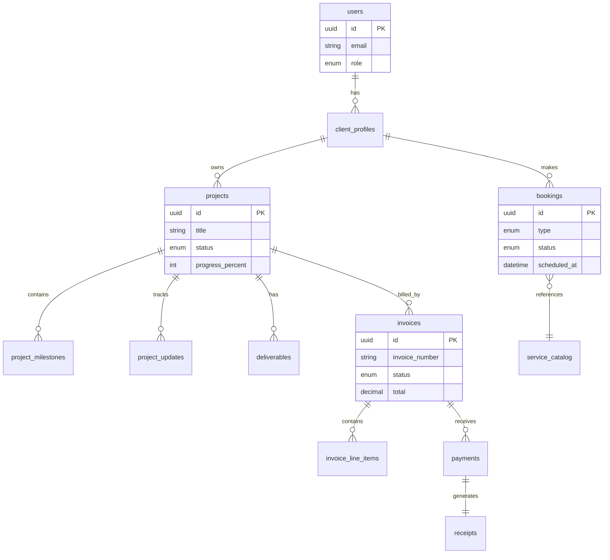

# SCH Dynamic Website & Portal Plan

## Current State

The site at [index.html](index.html) is a polished **static single-page marketing site** (HTML + Tailwind + vanilla JS) deployed to **Cloudflare Pages**. There is no backend today:

- Contact form in [js/ecosystem.js](js/ecosystem.js) fakes submission with `setTimeout` — no data is saved
- [sw.js](sw.js) stubs `/submit-contact` but it is not wired up
- Some clients already have **separate portals** (see [js/site-config.js](js/site-config.js): Quick Credit, Afrisites, Elgon Bottling, etc.)

Your goal is a **unified SCH platform**: Admin Portal + Client Portal with mixed bookings, work progress, and downloadable invoices/receipts.

---

## Recommended Architecture

**Keep marketing static. Add a separate portal app + API.**

This is the best fit for SCH because:
- Preserves SEO, speed, and PWA on the public site you already have
- Avoids rebuilding 1,200 lines of marketing UI in a framework
- Matches your existing pattern (client-specific portals on subdomains)
- Lets you ship portal features incrementally without risking the live homepage



### Stack Recommendation

| Layer | Choice | Why |
|-------|--------|-----|
| Marketing site | Keep current static site on Cloudflare Pages | Already live, fast, SEO-ready |
| Portal app | **Next.js 15 (App Router) + TypeScript** | Admin + client UIs, API routes, PDF generation, auth middleware |
| Database | **Supabase (PostgreSQL)** | Relational data for clients/projects/invoices; built-in auth option; storage; realtime for progress updates |
| Auth | **Supabase Auth** with roles (`admin`, `staff`, `client`) | Row-level security so clients only see their own data |
| File storage | **Supabase Storage** or **Cloudflare R2** | Deliverables, invoice PDFs, project assets |
| PDF docs | **@react-pdf/renderer** or **Puppeteer** server-side | Branded invoices/receipts as downloadable PDFs |
| Email | **Resend** or **SendGrid** | Invoice delivery, booking confirmations, progress notifications |
| Payments | **Paystack** (UG-friendly) + manual "bank transfer" recording | Cards + mobile money; admin marks offline payments |
| Hosting | Portal on **Vercel** (simplest for Next.js) or Cloudflare Pages with Node compat | Marketing stays on Cloudflare regardless |

**Why not Cloudflare-only (Workers + D1)?** Possible for a lighter system, but mixed bookings, PDF generation, role-based portals, and invoice numbering are easier and faster to build correctly in Next.js + Postgres.

---

## Domain & Routing

| URL | Purpose |
|-----|---------|
| `synergyconceptshub.com` | Public marketing (unchanged structure) |
| `portal.synergyconceptshub.com` | Client login + Admin login (role-based redirect after auth) |
| `portal.synergyconceptshub.com/admin/*` | Admin/staff only |
| `portal.synergyconceptshub.com/client/*` | Client only |

Add a **"Client Portal"** button in the marketing nav ([index.html](index.html)) linking to the portal login.

---

## Core Data Model

Design around **Projects** as the central entity (work progress), with **Bookings** as entry points that can spawn projects.



### Key tables

- **users** — auth identity + role (`admin`, `staff`, `client`)
- **client_profiles** — company name, phone, billing address, tax ID
- **service_catalog** — bookable offerings (consultation, branding package, website build, academy course)
- **bookings** — flexible `type`: `consultation`, `service_package`, `academy_enrollment`, `custom_request`
- **projects** — active client work; status pipeline: `lead → quoted → active → review → completed → archived`
- **project_milestones** — phases with due dates, approval status, % weight toward overall progress
- **project_updates** — timeline feed (notes, status changes, file uploads) visible to client
- **deliverables** — files/links clients can download
- **invoices** + **invoice_line_items** — numbered sequentially (e.g. `SCH-2026-0042`)
- **payments** — amount, method (`paystack`, `mobile_money`, `bank_transfer`, `cash`)
- **receipts** — auto-generated when payment is recorded or confirmed

---

## Feature Breakdown

### 1. Admin Portal

**Dashboard**
- Active projects, upcoming bookings, unpaid invoices, recent client activity

**Client management**
- Create/invite clients (email invite → set password)
- View client history: bookings, projects, invoices, payments

**Booking management**
- Calendar view for consultations
- Approve/decline/reschedule requests
- Convert approved booking → project

**Project management**
- Create project from booking or manually
- Define milestones and assign internal staff
- Post updates, upload deliverables
- Set progress % (manual or milestone-weighted auto-calc)

**Finance**
- Create/edit/send invoices
- Record offline payments
- Generate and download receipts
- Export invoice list (CSV)

**Service catalog**
- Manage bookable services, prices (UGX + optional USD), duration, deliverables included

**Academy module** (subset of bookings)
- Course listings synced from marketing content
- Enrollment bookings with payment status

**Staff roles**
- `admin` — full access
- `staff` — assigned projects only, no finance settings

### 2. Client Portal

**Dashboard**
- Active projects with progress bar and next milestone
- Upcoming bookings / consultations
- Outstanding invoices

**Bookings**
- Browse service catalog and request booking
- Pick consultation time slots (respect admin availability rules)
- Submit custom project brief (replaces current fake quote form flow)
- View booking status: `pending`, `confirmed`, `completed`, `cancelled`

**Project progress**
- Timeline of updates (text + attachments)
- Milestone checklist with approval actions ("Approve draft", "Request revision")
- Download deliverables

**Invoices & receipts**
- View invoice list with status badges
- Pay online (Paystack) where enabled
- Download invoice PDF and receipt PDF

**Profile**
- Update contact/billing details

### 3. Invoices & Receipts

**Generation flow**
1. Admin creates invoice from project (or standalone)
2. System assigns sequential invoice number
3. Server renders branded PDF (SCH logo, colors from [tailwind.config.js](tailwind.config.js): orange `#ED8C22`, blue `#1773B9`)
4. Client receives email with portal link + PDF attachment
5. On payment (online or admin-recorded), receipt PDF is auto-generated

**PDF contents**
- Invoice: line items, subtotal, tax (if applicable), payment terms, bank details
- Receipt: payment date, method, reference, amount, linked invoice number

**Tech approach**
- Store PDFs in object storage with signed download URLs
- Use a single React-PDF template component for consistent branding
- Keep HTML fallbacks for email bodies

### 4. Marketing Site Integration (minimal changes)

Changes to existing static site only where needed:

| File | Change |
|------|--------|
| [index.html](index.html) | Add "Client Portal" nav link; optionally "Book a Service" CTA |
| [js/ecosystem.js](js/ecosystem.js) | Replace fake `#quoteForm` submit with `fetch()` to portal API `/api/leads` |
| [js/site-config.js](js/site-config.js) | Add `portalUrl: 'https://portal.synergyconceptshub.com'` |
| [_headers](_headers) | Update CSP to allow portal API domain |

The quote form becomes a **lead capture endpoint** that creates a `custom_request` booking in `pending` status — admins see it in the dashboard.

---

## Mixed Booking System Design

Because you selected **mixed booking types**, use one `bookings` table with a `type` discriminator and type-specific JSON metadata:

| Type | Client selects | Admin action | Outcome |
|------|----------------|--------------|---------|
| `consultation` | Date/time slot + topic | Confirm/reschedule | Calendar event; may spawn project |
| `service_package` | Package from catalog | Accept + send quote/invoice | Creates project with predefined milestones |
| `academy_enrollment` | Course + intake info | Confirm + payment | Enrollment record; optional student portal access |
| `custom_request` | Brief via form | Review + quote | Creates project after quote accepted |
| `milestone_review` | (system-generated) | N/A — client action | Client approves/rejects a milestone |

**Progress tracking** is always on **projects**, not bookings. Bookings are the front door; projects are where ongoing work lives.

---

## Security & Access Control

- **Supabase Row Level Security (RLS)**: clients can `SELECT` only rows where `client_id = auth.uid()`
- **Middleware** in Next.js enforces role routes (`/admin/*`, `/client/*`)
- **Signed URLs** for file downloads (expire after 15 min)
- **Audit log** table for admin actions on invoices and payments
- Reuse existing security mindset from [_headers](_headers) on the marketing site; portal gets its own CSP

---

## Phased Rollout

### Phase 1 — Foundation (4–6 weeks)
- New repo or `portal/` monorepo folder: Next.js + Supabase
- Auth (admin + client roles), database schema, migrations
- Admin: client CRUD, invite flow
- Client: login, empty dashboard shell
- Deploy to `portal.synergyconceptshub.com`

### Phase 2 — Projects & Progress (3–4 weeks)
- Project + milestone + update CRUD (admin)
- Client project dashboard with timeline and progress bar
- File upload for deliverables
- Email notifications on new updates

### Phase 3 — Bookings (3–4 weeks)
- Service catalog admin
- Client booking flows (consultation slots, packages, custom request)
- Wire marketing quote form to API
- Admin booking calendar and approval workflow

### Phase 4 — Invoices & Receipts (3–4 weeks)
- Invoice builder, PDF generation, sequential numbering
- Payment recording (manual + Paystack integration)
- Receipt auto-generation and download
- Client invoice list + pay online

### Phase 5 — Polish & Migration (2–3 weeks)
- Academy enrollment booking type
- Migrate/link existing standalone client portals where desired
- Analytics, admin reports, CSV exports
- Staff role permissions

**Total estimate: ~15–21 weeks** for a small team (1–2 developers), shipping usable slices after each phase.

---

## Repository Structure (proposed)

```
SCH_Website_Upload/          # existing — marketing site (keep)
portal/                      # new — Next.js app
├── app/
│   ├── (auth)/login/
│   ├── admin/               # admin routes
│   ├── client/              # client routes
│   └── api/                 # REST + webhooks (Paystack)
├── components/
├── lib/
│   ├── supabase/
│   ├── pdf/                 # invoice + receipt templates
│   └── email/
├── supabase/migrations/
└── package.json
```

Alternative: separate Git repo `sch-portal` if you prefer clean CI/CD separation from the marketing deploy pipeline in [.github/workflows/deploy-cloudflare-pages.yml](.github/workflows/deploy-cloudflare-pages.yml).

---

## What Happens to Existing Client Portals

Clients in [js/site-config.js](js/site-config.js) (Quick Credit, Afrisites, Elgon Bottling, etc.) are **custom-built apps**, not part of this site. Options:

1. **Keep separate** — SCH portal handles SCH-direct clients only; custom apps remain for product clients
2. **Link from portal** — admin can attach external portal URL to a client profile
3. **Gradual migration** — only if those clients need the same booking/invoice features

Recommend **option 1 + 2** initially to avoid scope explosion.

---

## Cost Estimate (monthly, starting)

| Service | Approx. cost |
|---------|-------------|
| Supabase (Free tier) | $0 | Start here; monitor DB size (500MB limit) and bandwidth (2GB/mo) |
| Vercel (Pro) | $20 |
| Resend email | $0–20 |
| Cloudflare Pages (marketing) | $0 |
| Paystack | Transaction fees only |
| Domain subdomains | $0 (existing domain) |

**~$45–65/month** at low traffic, excluding payment processing fees.

---

## Key Risks & Mitigations

| Risk | Mitigation |
|------|------------|
| Scope creep from "mixed" booking types | Ship `custom_request` + `consultation` first; add academy/packages in Phase 3 |
| Rebuilding marketing site unnecessarily | Explicit rule: marketing stays static unless a page needs dynamic data |
| Invoice compliance (Uganda tax/VAT) | Confirm VAT requirements with accountant; add `tax_rate` field early |
| Small team maintenance burden | Supabase + Next.js + one payment provider; avoid microservices |
| Existing client portals confusion | Clear naming: "SCH Client Portal" vs product-specific portals |

---

## Success Criteria

- Admin can onboard a client, create a project, post progress, and send an invoice without leaving the portal
- Client can log in, see project progress, book a consultation, pay/view/download invoices and receipts
- Marketing site quote form creates a real lead in the admin dashboard
- PDF invoices/receipts download with SCH branding and sequential numbering
